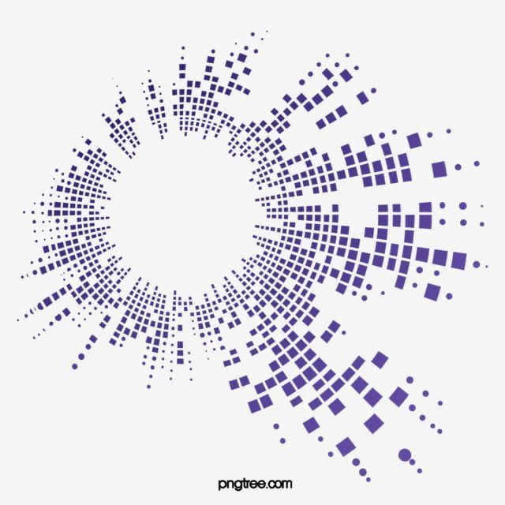
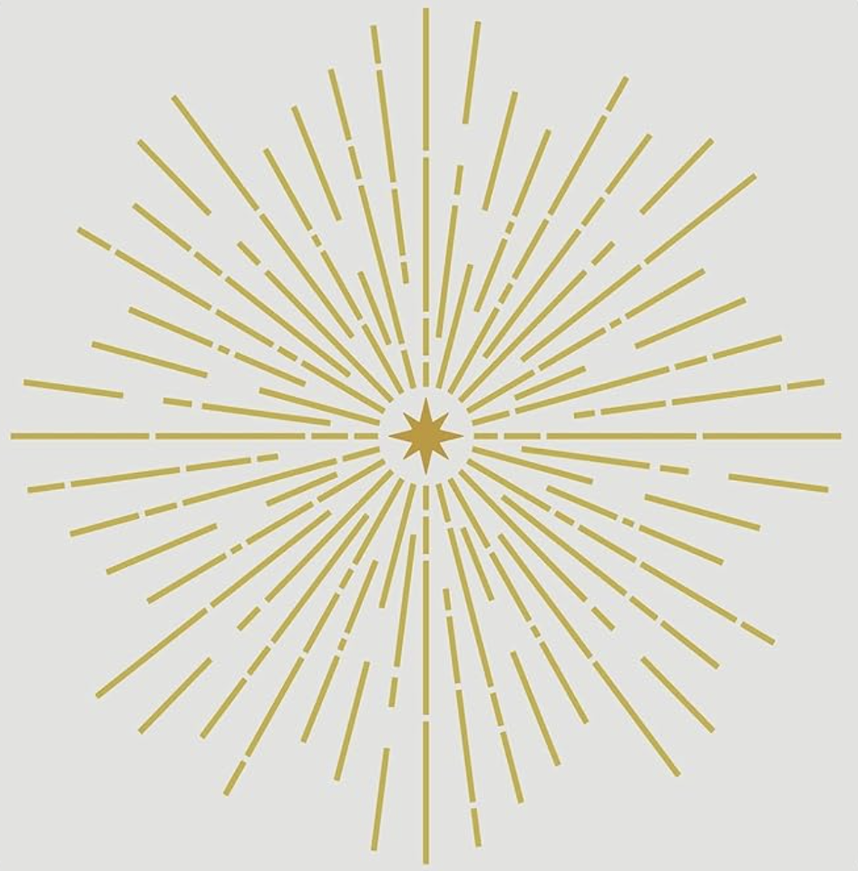
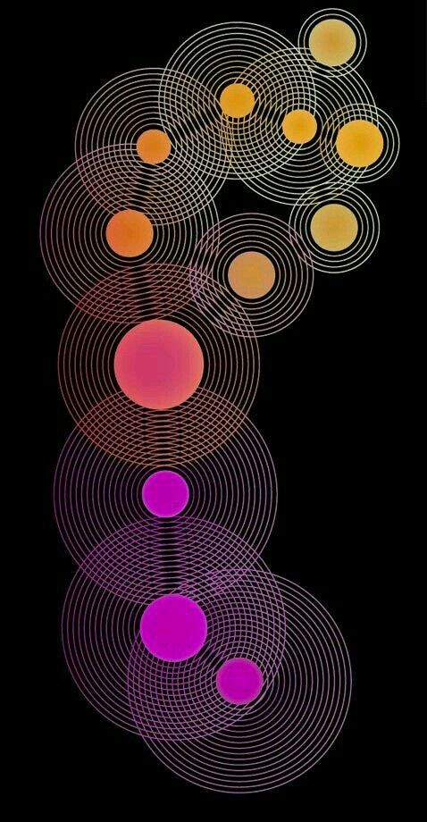

# groupB_9103_tut3

## How to Interact11111

This audio-reactive visualization responds to both music and user input. The detailed interaction methods are outlined below:

- **Play/Pause Button:** Click the button at the bottom center of the screen to play or pause the music. The visualization only animates when music is playing.

- **Volume Control (Mouse Y-axis):** Move the mouse vertically to control volume. Moving towards the top increases volume (up to 1.0), while moving towards the bottom decreases it (down to 0.0).

- **Stereo Panning (Mouse X-axis):** Move the mouse horizontally to control stereo panning. Moving left pans the audio to the left channel (-1.0), while moving right pans to the right channel (+1.0).

- **Audio-Reactive Elements:** The visualization automatically responds to the music's frequency spectrum and amplitude, creating dynamic animations that pulse and move with the beat.

## Details of My Individual Approach to Animating the Group Code

### Choice
I chose **Audio Input** combined with **User Input** to drive my personal code.

### My code features
My personal code design creates an immersive audio-visual experience inspired by cosmic phenomena. The main visual elements include concentric circles, radiating lines, stars, and meteors that respond to music in real-time. The amplitude (RMS) values control the size and intensity of visual elements, while the frequency spectrum (FFT) drives the color variations and point distributions. The mouse interaction adds an extra layer of user control, allowing real-time manipulation of the audio experience. The overall aesthetic combines vibrant HSB colors with a dark background to create depth and visual interest.

## Inspiration
# Music Visualization – Design Inspiration

My work revolves around music visualization, mainly utilizing size, color, and rhythm changes. The inspiration mainly comes from the following three visual images:

- **Picture 1** presents a rhythmic diffusion pattern composed of many square units, forming a structure similar to sound waves or ripples. I borrowed this structure and used the `diverPoint()` and `randomPoint()` methods in the group code to convert the audio spectrum into a dynamically diffused dot matrix. This approach imitates the rhythmic arrangement of small elements in the image, making my visual work rich in variation and tension.

- **Picture 2** displays a linear structure radiating outward from a central point. It conveys a strong sense of direction and order, resulting in a striking visual impact. This inspired me to incorporate multiple sets of radial lines and geometric structures in my work. By using the `drawLine()` method in the group code, and adjusting the transparency and line length, I was able to recreate a similar sense of rhythm and visual intensity.

- **Picture 3** uses colorful dots of varying sizes, surrounded by concentric rings, to build a composition full of rhythm and visual depth. The shifting colors of the rings introduce strong hierarchy and motion. This directly inspired my use of the `drawTriangle()` method, where triangle size responds dynamically to the music volume, and the overall color palette gradually transitions to enhance visual dynamism.



**Picture 1** ([Source](https://www.pinterest.com/pin/1477812373483954/))



**Picture 2** ([Source](https://www.amazon.com/FINGERINSPIRE-Starburst-Stencils-11-8x11-8-Painting/dp/B0B8234XNW/ref=asc_df_B0B8234XNW?tag=ushpadpinde-20&hvdev=c&hvpone=626752247357&hvptwo=2680081096481&hvqmt=4260608469520&hvadid=4672955233506&psc=1&pp=0&epik=dj0yJnU9cVV0bUlXWndtTl9QcmtaOGVCWFpHcTFxMlIwQWpjUmsmcD0xJm49XzFHN1FZZmZiZHViNEtILVVIcUJPdyZ0PUFBQUFBR2hMdmE4))



**Picture 3** ([Source](https://www.pinterest.com/pin/68748368248/))

## Technical Explanation

### Audio Analysis Setup
The code uses p5.sound library for audio analysis. FFT analyzes the frequency spectrum, while the Amplitude analyzer captures the overall volume level.

```javascript
analyser = new p5.Amplitude();
analyser.setInput(song);
fft = new p5.FFT(smoothing, numBins);
song.connect(fft);
```

### Volume and Pan Control via Mouse Movement
Mouse position is mapped to control audio parameters in real-time. The Y-axis controls volume (0-1) and X-axis controls stereo panning (-1 to 1).

```javascript
function mouseMoved() {
  // Map volume according to the mouse Y coordinate
  volume = map(mouseY, 0, height, 1, 0);
  song.setVolume(volume);
  
  // Set stereo channel based on mouse X coordinate
  pan = map(mouseX, 0, width, -1, 1);
  song.pan(pan);
}
```

### Dynamic Visual Elements Based on Audio
The visualization size and colors respond to the audio analysis. The rms value determines the overall size, while colors shift based on both rms and time.

```javascript
let spectrum = fft.analyze();
let rms = analyser.getLevel();

// Dynamic sizing based on audio
let totalR = max(noise(rms * 0.5) * width / 4, width / 20);

// Dynamic coloring based on audio and time
let color1 = color(rms * 255 + frameCount % 255, 255, 255, 255);
let color2 = color(rms * 255 + frameCount % 255, 255, 255, 70);
```

### Radiating Lines Responsive to Audio
The drawLine() method creates lines that radiate outward, with their length determined by the RMS amplitude value.

```javascript
drawLine(rms) {
  let drawLineDegree = 30;
  for (let j = 0; j < 12; j++) {
    for (let i = 0; i < 5; i++) {
      let x1 = cos(drawLineDegree * j - 67.5 - i * random(12.5)) * this.size * rms * 17 + this.x;
      let y1 = sin(drawLineDegree * j - 67.5 - i * random(12.5)) * this.size * rms * 17 + this.y;
      line(this.x, this.y, x1, y1);
    }
  }
}
```

### Frequency Spectrum Visualization
The diverPoint() method visualizes the frequency spectrum as colored dots arranged in a circle, with amplitude determining the number and size of dots.

```javascript
diverPoint(spectrum) {
  for (let j = 0; j < spectrum.length; j++) {
    let amp = spectrum[j];
    let maxPoints = floor(map(amp, 0, 255, 3, 15));
    
    for (let i = 0; i < maxPoints; i++) {
      fill(amp, 255, 255);
      let diffusionR = max(((1.5 + amp / 255 * 1.2) * (1 - i * 0.05) * 2.5), 2.8);
      // Position and draw dots based on frequency data
    }
  }
}
```

