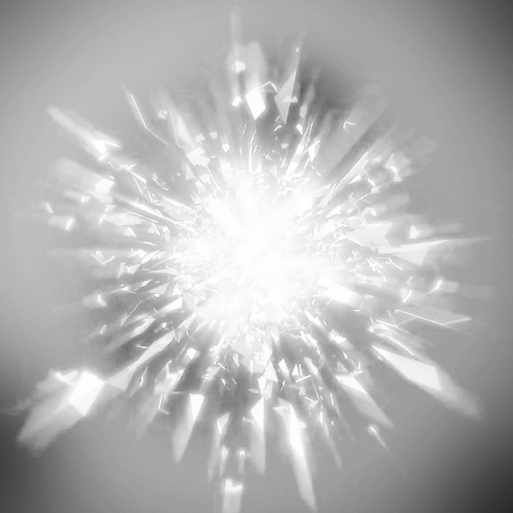
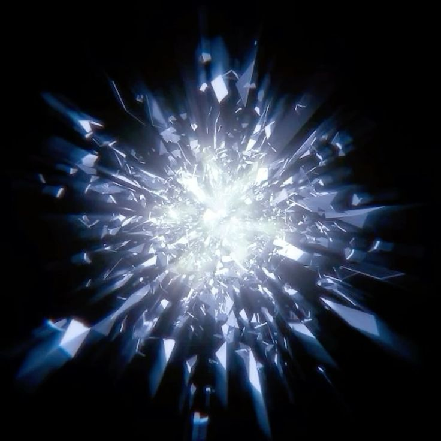

# groupB_9103_tut3

## How to Interact11111

This audio-reactive visualization responds to both music and user input. The detailed interaction methods are outlined below:

- **Play/Pause Button:** Click the button at the bottom center of the screen to play or pause the music. The visualization only animates when music is playing.

- **Volume Control (Mouse Y-axis):** Move the mouse vertically to control volume. Moving towards the top increases volume (up to 1.0), while moving towards the bottom decreases it (down to 0.0).

- **Stereo Panning (Mouse X-axis):** Move the mouse horizontally to control stereo panning. Moving left pans the audio to the left channel (-1.0), while moving right pans to the right channel (+1.0).

- **Audio-Reactive Elements:** The visualization automatically responds to the music's frequency spectrum and amplitude, creating dynamic animations that pulse and move with the beat.

## Details of My Individual Approach to Animating the Group Code

### Choice
I chose **Audio Input** combined with **User Input** to drive my personal code.

### My code features
My personal code design creates an immersive audio-visual experience inspired by cosmic phenomena. The main visual elements include concentric circles, radiating lines, stars, and meteors that respond to music in real-time. The amplitude (RMS) values control the size and intensity of visual elements, while the frequency spectrum (FFT) drives the color variations and point distributions. The mouse interaction adds an extra layer of user control, allowing real-time manipulation of the audio experience. The overall aesthetic combines vibrant HSB colors with a dark background and texture overlay to create depth and visual interest.

## Inspiration
My work is inspired by the following concepts:

- **Audio Visualizers:** Classic music visualization software that creates geometric patterns synchronized with music. The radiating lines and pulsing circles directly respond to the audio amplitude, creating a sense of rhythm and energy.

- **Cosmic Phenomena:** The meteor shower effect and star patterns create a space-like atmosphere. The combination of static stars and moving meteors adds both stability and dynamism to the composition.

- **Texture Overlays:** The use of multiply blend mode with textured overlays adds depth and visual complexity to the final output.

### Visual Assets


**Picture 1:** Main radial burst texture overlay

  
**Picture 2:** Blue-tinted cosmic texture variation

## Technical Explanation

### Audio Analysis Setup
The code uses p5.sound library for audio analysis. FFT (Fast Fourier Transform) analyzes the frequency spectrum, while the Amplitude analyzer captures the overall volume level.

```javascript
analyser = new p5.Amplitude();
analyser.setInput(song);
fft = new p5.FFT(smoothing, numBins);
song.connect(fft);
```

### Volume and Pan Control via Mouse Movement
Mouse position is mapped to control audio parameters in real-time. The Y-axis controls volume (0-1) and X-axis controls stereo panning (-1 to 1).

```javascript
function mouseMoved() {
  // Map volume according to the mouse Y coordinate
  volume = map(mouseY, 0, height, 1, 0);
  song.setVolume(volume);
  
  // Set stereo channel based on mouse X coordinate
  pan = map(mouseX, 0, width, -1, 1);
  song.pan(pan);
}
```

### Dynamic Visual Elements Based on Audio
The visualization size and colors respond to the audio analysis. The RMS (Root Mean Square) value determines the overall size, while colors shift based on both RMS and time.

```javascript
let spectrum = fft.analyze();
let rms = analyser.getLevel();

// Dynamic sizing based on audio
let totalR = max(noise(rms * 0.5) * width / 4, width / 20);

// Dynamic coloring based on audio and time
let color1 = color(rms * 255 + frameCount % 255, 255, 255, 255);
let color2 = color(rms * 255 + frameCount % 255, 255, 255, 70);
```

### Radiating Lines Responsive to Audio
The drawLine() method creates lines that radiate outward, with their length determined by the RMS amplitude value.

```javascript
drawLine(rms) {
  let drawLineDegree = 30;
  for (let j = 0; j < 12; j++) {
    for (let i = 0; i < 5; i++) {
      let x1 = cos(drawLineDegree * j - 67.5 - i * random(12.5)) * this.size * rms * 17 + this.x;
      let y1 = sin(drawLineDegree * j - 67.5 - i * random(12.5)) * this.size * rms * 17 + this.y;
      line(this.x, this.y, x1, y1);
    }
  }
}
```

### Frequency Spectrum Visualization
The diverPoint() method visualizes the frequency spectrum as colored dots arranged in a circle, with amplitude determining the number and size of dots.

```javascript
diverPoint(spectrum) {
  for (let j = 0; j < spectrum.length; j++) {
    let amp = spectrum[j];
    let maxPoints = floor(map(amp, 0, 255, 3, 15));
    
    for (let i = 0; i < maxPoints; i++) {
      fill(amp, 255, 255);
      let diffusionR = max(((1.5 + amp / 255 * 1.2) * (1 - i * 0.05) * 2.5), 2.8);
      // Position and draw dots based on frequency data
    }
  }
}
```

### Meteor Layer Effect
A separate graphics layer creates animated meteors for added visual depth. The meteors are randomly positioned with varying lengths and weights.

```javascript
meteorLayer = createGraphics(windowWidth, windowHeight);
drawMeteorLayer();

// In the drawMeteorLayer function
for (let i = 0; i < meteorCount; i++) {
  let x = random(width);
  let y = random(height);
  let len = random(minLength, maxLength);
  let weight = random(minWeight, maxWeight);
  // Draw meteor with head and tail
}
```

### Texture Overlay with Blend Mode
The final visual effect is achieved by applying a texture overlay using the MULTIPLY blend mode, which creates depth and visual richness.

```javascript
push();
blendMode(MULTIPLY);
image(overallTexture, 0, 0, width, height);
pop();
```
